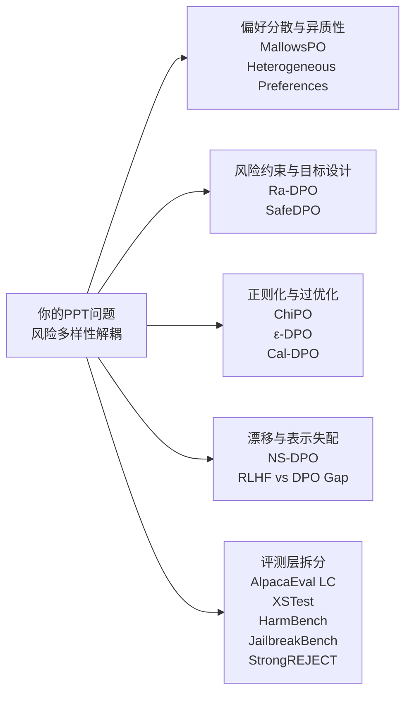

# DPO相关最新论文与安全评测深度综述

## 执行摘要

围绕 NeurIPS、ICLR、ICML 近三年的正式录用论文与最新公开投稿条目，以及 USENIX Security 等 CCF-A 安全会议，我检索到的 DPO 相关研究，已经明显分成三条主线：其一是**目标函数与正则化改造**，代表工作包括 SimPO、Cal-DPO、χPO、BPO、ε-DPO、ConfPO；其二是**偏好分散性、异质性与动态性**，代表工作包括 MallowsPO、Direct Alignment with Heterogeneous Preferences、NS-DPO；其三是**安全/稳健性导向的偏好优化**，代表工作包括 Ra-DPO、SafeDPO、ShaPO，以及使用 HarmBench、JailbreakBench、XSTest、StrongREJECT 等评测体系的安全论文。整体上，主流文献已经充分认识到：单一平均偏好并不足以解释模型行为，KL 约束也不足以保证安全稳健，而评测若只看 win rate 或单轮拒答率，往往会漏掉过度拒答、分布外脆弱性和风险迁移等问题。citeturn24search2turn25search6turn31search1turn31search0turn31search5turn26search6turn8search5turn32academia13turn12academia44turn11academia47turn23academia21turn22academia49

和你的 PPT 对照看，最值得强调的是：你的研究并不是简单地再做一个“更好”的 DPO 变体，而是在问一个当前主流论文很少直接回答的问题——**DPO 后的风险变化是否必然与输出多样性下降绑定，还是会出现“风险上升但分布更散/不更窄”的解耦现象**。你的 PPT 已经把这个问题形式化成多采样输出上的风险均值、风险确定性、模式熵与攻击有效性之间的关系，并提出“风险多样性解耦”的核心假设；这与 MallowsPO 的“偏好离散度”、异质偏好理论、风险约束 DPO、以及安全 benchmark 中的过拒答/越狱评测，形成了非常自然的对接。换句话说，文献里已经分别有人研究“偏好分散”“安全风险”“分布漂移”和“评测偏差”，但**很少有人把这几者在同一个语言模型后训练框架里统一起来**；这正是你的课题最有潜力形成差异化贡献的位置。fileciteturn0file0L45-L58 fileciteturn0file0L66-L94 fileciteturn0file0L128-L160 fileciteturn0file0L187-L201 fileciteturn0file0L208-L229 fileciteturn0file0L235-L252 citeturn31search5turn29search1turn26search6turn31search0turn23academia21turn12academia44turn11academia47

如果你要把报告压缩成 PPT 主线，我建议用六篇论文作为主轴：**MallowsPO、Direct Alignment with Heterogeneous Preferences、Ra-DPO、SafeDPO、χPO、ε-DPO**。其中 MallowsPO 和异质偏好论文负责回答“为什么平均偏好不够”；Ra-DPO 和 SafeDPO 负责回答“如何把风险显式放进目标”；χPO 和 ε-DPO 负责回答“为什么 vanilla DPO 的 KL/对数链接控制不足，容易出现过优化或局部漂移”。再加上 **XSTest + HarmBench + JailbreakBench + StrongREJECT** 作为评测组合，你的课题就能形成“机制—目标—评测”三层闭环。citeturn31search5turn29search1turn26search6turn24academia36turn25search6turn26academia49turn23academia21turn12academia44turn11academia47turn22academia49

## 检索范围与筛选口径

本报告优先使用**官方或原始来源**：NeurIPS proceedings/virtual、ICLR proceedings/OpenReview、ICML/PMLR/OpenReview、USENIX Security 官方论文页，以及 arXiv 预印本；代码与数据链接仅在官方页、作者主页、项目页或明确 GitHub 页面可稳定确认时列出。由于截至 **2026-07-18**，公开可稳定检索的“最新投稿”主要集中在 OpenReview 上的 **ICLR 2026** 与部分 **ICML 2026 regular** 条目，因此我将“已录用”和“已投稿/审稿中”分开标注，避免把 under review 误写成 accepted。citeturn8search5turn8search9turn32academia13turn24academia36

筛选时，我把 “DPO” 扩展为一组同义相关方向：**Direct Preference Optimization、Preference Optimization、Direct Alignment Algorithms、Preference Learning、Preference Modeling、Safety Alignment with Preference Data、RLHF vs DPO**。同时，为了与你的 PPT 主题对齐，我优先保留满足下列至少一项的论文：**显式讨论风险/安全约束、讨论偏好异质性或分散性、讨论偏好漂移、讨论 KL/过优化/稳健性、或采用能够同时覆盖 helpfulness 与 safety 的 benchmark/数据集**。纯图像/视频 DPO 论文没有作为主表核心条目，只在需要时作为方法旁证。citeturn24search2turn25search6turn31search1turn31search0turn31search5turn26search6turn29search1turn8search5turn32academia13

从你的 PPT 已有实验设计看，你已经把问题定义为：在同一 prompt 上做多次采样后，分别统计**有害比例、是否给出“yes”的风险判断概率、风险判定确定性、分布熵、以及攻击 ASR**，并尝试验证“DPO 可能在不压缩甚至扩大响应分布的同时抬升风险”的假设。这意味着你后续最需要的不是再找更多“提升 AlpacaEval 分数”的 DPO 论文，而是要找那些能帮助你解释**风险—多样性解耦**的工作，以及能把“风险提升”与“过度拒答/评测偏差/分布外脆弱性”区分开的 benchmark 论文。fileciteturn0file0L66-L94 fileciteturn0file0L128-L160 fileciteturn0file0L187-L201 fileciteturn0file0L208-L229 fileciteturn0file0L235-L252

## 核心论文总表

### 主会录用论文

| 论文 | 状态 | 会议/年份 | 最值得关注的点 | 主要链接 |
|---|---|---|---|---|
| **SimPO: Simple Preference Optimization with a Reference-Free Reward** | 已录用 | NeurIPS 2024 | 去掉 reference model，用平均 log-prob 作为隐式奖励；是非常强的 DPO-family 基线 | 官方页/PDF citeturn24search2 预印本 citeturn24academia37 代码 citeturn27search0 |
| **Cal-DPO: Calibrated Direct Preference Optimization for Language Model Alignment** | 已录用 | NeurIPS 2024 | 显式校准隐式奖励尺度，解决只学“相对差”不学“绝对值”的问题 | 官方页/PDF citeturn4search4 预印本 citeturn4academia48 代码 citeturn26search2 |
| **Correcting the Mythos of KL-Regularization via Chi-Squared Preference Optimization** | 已录用 | ICLR 2025 Spotlight | 说明 KL 正则不足以阻止过优化，提出 χPO 替换 DPO 链接函数 | 官方页/PDF citeturn25search6 预印本 citeturn25academia49 |
| **MallowsPO: Fine-Tune Your LLM with Preference Dispersions** | 已录用 | ICLR 2025 | 用 dispersion index 显式建模偏好分散性，是与你 PPT 最直接相连的论文之一 | 官方页/PDF citeturn31search5 预印本 citeturn34academia47 |
| **ConfPO: Exploiting Policy Model Confidence for Critical Token Selection in Preference Optimization** | 已录用 | ICML 2025 | 挑 preference-critical tokens 做优化，提高对 KL 预算的使用效率 | 官方页/PDF citeturn31search1 预印本 citeturn5academia49 代码 citeturn5search1 |
| **Right Now, Wrong Then: Non-Stationary Direct Preference Optimization under Preference Drift** | 已录用 | ICML 2025 | 把时间漂移显式放进 Bradley–Terry 与损失加权，专门处理偏好 drift | 官方页/PDF citeturn31search0 预印本 citeturn31academia48 |
| **Preference Optimization by Estimating the Ratio of the Data Distribution** | 已录用 | NeurIPS 2025 | BPO 统一 DPO 为比例匹配；实验上同时改善 win rate 与 entropy | 官方页/PDF citeturn26search3 预印本 citeturn26academia50 代码 citeturn26search3 |
| **KL Penalty Control via Perturbation for Direct Preference Optimization** | 已录用 | NeurIPS 2025 | ε-DPO 做 instance-level 动态 KL，是控制策略漂移的直接手段 | 官方页/PDF citeturn2search0 预印本 citeturn26academia49 |
| **Risk-aware Direct Preference Optimization under Nested Risk Measure** | 已录用 | NeurIPS 2025 | 把 nested risk measure 放进 DPO，是最贴近“风险感知 DPO”的主会论文之一 | 官方页/PDF citeturn26search6 预印本 citeturn26academia48 代码 citeturn26academia48 |
| **Direct Alignment with Heterogeneous Preferences** | 已录用 | NeurIPS 2025 | 理论化“偏好异质性”，指出单一策略下平均偏好并不代表所有用户类型 | 官方页/PDF citeturn29search1 预印本 citeturn34academia48 |

### 最新公开投稿与在审条目

| 论文 | 状态 | 会议/年份 | 你为什么要看 | 主要链接 |
|---|---|---|---|---|
| **SafeDPO: A Simple Approach to Direct Preference Optimization with Enhanced Safety** | 已投稿 | ICLR 2025 Submitted | 直接把安全约束写成 DPO 风格目标，最适合作为“安全版 DPO”对照 | OpenReview citeturn1search9 预印本 citeturn24academia36 |
| **Understanding the Performance Gap in Preference Learning: A Dichotomy of RLHF and DPO** | 已投稿 | ICLR 2026 Submitted | 理论解释 RLHF 与 DPO 的失配来源，对你理解“为什么 DPO 会出风险异常”很重要 | OpenReview citeturn8search5 预印本 citeturn6academia48 |
| **Revisiting Robustness for LLM Safety Alignment via Selective Geometry Control** | 已投稿/公开 Regular 条目 | ICML 2026 | 从优化几何而非数据噪声看安全脆弱性，提出 ShaPO | OpenReview 条目 citeturn8search9 预印本 citeturn34academia49 代码线索 citeturn34search2 |

### CCF-A安全会议扩展条目

| 论文 | 会议/年份 | 作用 | 为什么与你的课题相关 | 主要链接 |
|---|---|---|---|---|
| **LLM-Fuzzer: Scaling Assessment of Large Language Model Jailbreaks** | USENIX Security 2024 | 自动化越狱评测 | 可用于验证 DPO 后模型是否在多轮/变体 prompt 下更易越狱 | 官方页/PDF citeturn18search6 |
| **Formalizing and Benchmarking Prompt Injection Attacks and Defenses** | USENIX Security 2024 | 提示注入 benchmark | 帮你把“风险上升”与“应用级提示注入脆弱性”区分开 | 官方页/PDF citeturn21search0 |
| **TwinBreak: Jailbreaking LLM Security Alignments based on Twin Prompts** | USENIX Security 2025 | 对齐移除攻击 | 说明“安全对齐”本身可能像脆弱 backdoor，一旦被针对就会失守 | 官方页/PDF citeturn21search9 |
| **Exploiting Task-Level Vulnerabilities: An Automatic Jailbreak Attack and Defense Benchmarking for LLMs** | USENIX Security 2025 | 任务级越狱与防御评测 | 说明仅做 prompt-level 防御不够，任务分解层面的风险也可能被 DPO 放大 | 官方页/PDF citeturn21search8 |

## 论文详解

### SimPO

**标题与作者**：*SimPO: Simple Preference Optimization with a Reference-Free Reward*，Yu Meng、Mengzhou Xia、Danqi Chen；NeurIPS 2024。  
**中文摘要**：该文指出，DPO 的隐式奖励与真实生成过程之间存在训练—生成不一致，尤其体现在 reference model 与序列长度耦合上。作者把隐式奖励改为**序列平均 log 概率**，从而不再需要 reference model；同时在 Bradley–Terry 目标中加入**目标奖励间隔**，让 winning response 与 losing response 的分离更大。  
**方法要点**：模型架构仍是标准自回归 LLM；损失仍以 pairwise preference 为核心，但把 DPO 的 reward parameterization 换成 reference-free、length-normalized 的形式，并加入 margin。训练流程是 SFT 后接 SimPO；评测流程主要用 AlpacaEval 2、MT-Bench、Arena-Hard。  
**主要贡献与结果**：它提供了一个足够强、又足够简单的基线：Gemma-2-9B-it-SimPO 在作者报告中达到 **72.4% AlpacaEval 2 length-controlled win rate** 和 **59.1% Arena-Hard win rate**，显著强于对照 DPO。代码与模型均已公开。  
**与 PPT 的相关性**：如果你的“风险—多样性解耦”现象只在 reference-based DPO 出现，而在 SimPO 不明显，那么你就能把问题更具体地定位到 **reference/KL 绑定机制** 而不是偏好优化本身。citeturn24search2turn24academia37turn27search0

### Cal-DPO

**标题与作者**：*Cal-DPO: Calibrated Direct Preference Optimization for Language Model Alignment*，Teng Xiao、Yige Yuan、Huaisheng Zhu、Mingxiao Li、Vasant Honavar；NeurIPS 2024。  
**中文摘要**：作者认为，DPO/对比式偏好优化通常只学习“chosen 比 rejected 更好”，却没有让隐式奖励尺度与真实奖励尺度保持可比，因此会造成对齐不足甚至训练异常。Cal-DPO 的核心做法是**显式校准隐式奖励尺度**。  
**方法要点**：仍然基于 Bradley–Terry 风格的 pairwise 对比，但加入 reward calibration，使 learned implicit reward 与 ground-truth reward 的尺度更一致；本质上是对 DPO 目标的简单但结构性修正。训练流程与常见 RLHF 后训练一致，评测覆盖标准聊天/推理 benchmark。  
**主要贡献与结果**：论文强调其理论优势与广泛实验上的显著提升；官方已提供代码仓库。  
**与 PPT 的相关性**：如果你的实验观察到某些有害模式被“系统性推高”，Cal-DPO 提供了一个合理解释框架：这可能不是风险模式天然更优，而是**隐式奖励尺度失真**后，对某类输出给了过强推动。citeturn4search4turn4academia48turn26search2

### χPO

**标题与作者**：*Correcting the Mythos of KL-Regularization: Direct Alignment without Overoptimization via Chi-Squared Preference Optimization*，Audrey Huang、Wenhao Zhan、Tengyang Xie、Jason Lee、Wen Sun、Akshay Krishnamurthy、Dylan Foster；ICLR 2025 Spotlight。  
**中文摘要**：该文直接挑战一个在 DPO 领域常见但很少被严格回答的假设：**KL regularization 是否真的足够阻止过优化**。作者结论是否定的，并提出只改一行链接函数的 χPO，用 χ²-divergence 替代 KL 隐式实现“pessimism in the face of uncertainty”。  
**方法要点**：模型架构不变，核心是把 DPO 中对数链接替换为 χ² 风格链接；目标函数依旧在 preference pair 上训练，但其 regularization geometry 明显更保守。理论上给出基于 single-policy concentrability 的样本复杂度保证。  
**主要贡献与结果**：这是近两年最重要的 DPO 理论论文之一，因为它把“过优化”从经验观察上升成了可证明问题，并给出简单替代方案。  
**与 PPT 的相关性**：你的问题本质上也在追问“为什么表面上仍在对齐、但风险分布却可能朝坏方向移动”。χPO 给出的答案是：**KL 可能太弱，无法阻止模型向数据稀疏、风险更高的区域漂移**。这几乎可以直接作为你 PPT 的理论动机页。citeturn25search6turn25academia49turn25search5

### MallowsPO

**标题与作者**：*MallowsPO: Fine-Tune Your LLM with Preference Dispersions*，Haoxian Chen、Hanyang Zhao、Henry Lam、David Yao、Wenpin Tang；ICLR 2025。  
**中文摘要**：这篇论文指出，DPO 的一个根本弱点是**只能看平均偏好，不会显式表示“偏好分散/离散程度”**。作者借鉴 Mallows ranking model，引入 **dispersion index** 来描述同一 prompt 上人类偏好的离散度，并证明 DPO 可以看作其特例。  
**方法要点**：在原有 preference optimization 目标上加入 dispersion-aware 参数化，把 pairwise preference 的“平均方向”与“分散程度”区分开；既可单独使用，也可作为插件加到现有离线偏好优化方法上。实验包含 synthetic bandit、controllable generation、dialogue，以及 Llama3-Instruct 上的插件实验。  
**主要贡献与结果**：作者报告，把 MallowsPO 作为插件用于 Llama3-Instruct 的偏好微调时，**length-controlled win rate 还能再提高接近 2%**。  
**与 PPT 的相关性**：这是与你 PPT 主题最直接的一篇。你的工作在研究“风险是否会在多样输出里分散出现”，而 MallowsPO 说明：**偏好优化里本来就存在一个经常被忽略的‘分散度维度’**。你完全可以把它当作你课题的最近邻文献。citeturn31search5turn34academia47

### ConfPO

**标题与作者**：*ConfPO: Exploiting Policy Model Confidence for Critical Token Selection in Preference Optimization*，Hee Suk Yoon、Eunseop Yoon、Mark A. Hasegawa-Johnson、Sungwoong Kim、Chang D. Yoo；ICML 2025。  
**中文摘要**：论文认为 DPO 类方法把所有 token 一视同仁进行更新，但真正决定 preference 的 token 往往只是少数。ConfPO 利用**当前策略的置信度**识别 preference-critical tokens，把优化预算聚焦在更关键的位置。  
**方法要点**：不引入额外 credit assignment 模型，也不使用额外 AI judge；直接从 policy logits/置信度中筛出关键 token，再在 token-level 做更有效的 preference update。这样既保持 DPO 风格的简洁性，又减少把 KL 预算浪费在无关 token 上。  
**主要贡献与结果**：作者在 AlpacaEval 2 和 Arena-Hard 上报告，相比 uniform DAA，ConfPO 一致更优，并且**没有额外计算开销**；代码由作者公开。  
**与 PPT 的相关性**：如果你的“风险分散”来自局部触发 token 或敏感片段，而不是整句整体模式，那么 ConfPO 很适合作为解释工具：它提示我们，**风险放大也许是 token-level credit 错配，而不是 response-level 多样性本身**。citeturn31search1turn5academia49turn5search1

### NS-DPO

**标题与作者**：*Right Now, Wrong Then: Non-Stationary Direct Preference Optimization under Preference Drift*，Seongho Son、William Bankes、Sayak Ray Chowdhury、Brooks Paige、Ilija Bogunovic；ICML 2025。  
**中文摘要**：作者关注的是另一个被平均化假设忽略的问题：**偏好并不是静态的**。某些回答在过去被偏好，到了新的社会/任务环境中可能已经不再是最佳。NS-DPO 用 Dynamic Bradley–Terry model 建模时间相关的偏好函数，并用指数加权把学习重点放在较新的偏好数据上。  
**方法要点**：核心损失仍然来自 pairwise preference，但给每个 preference pair 一个与时间相关的 discount；训练时对更新策略进行时间再加权。  
**主要贡献与结果**：PMLR 页面给出理论收敛分析与实验结论，说明在模拟 preference drift 时，NS-DPO 明显优于忽略时间变化的基线，并且在静态场景下也不退化。  
**与 PPT 的相关性**：你的风险实验若涉及多个数据源、多个对话域或多轮后训练阶段，就很容易混入“旧偏好/旧安全规范”与“新偏好/新安全政策”的冲突。NS-DPO 提供的是**纵向时间漂移**视角，可用于解释为什么某些风险模式不是被 DPO 凭空创造，而是被旧数据强化。citeturn31search0turn31academia48

### BPO

**标题与作者**：*Preference Optimization by Estimating the Ratio of the Data Distribution*，Yeongmin Kim、Heesun Bae、Byeonghu Na、Il-Chul Moon；NeurIPS 2025。  
**中文摘要**：该文把 DPO 重新解释为**likelihood ratio matching** 问题，并提出 Bregman Preference Optimization。BPO 不把 DPO 当作唯一正确形式，而是构建一个更广义的 Bregman family，使 DPO 成为其中一个特例。  
**方法要点**：用 target policy ratio 的唯一可识别性来替代 reward model/partition function；损失是 tractable 的 Bregman-family objective，并进一步提出 SBA 作为 gradient scaling 机制。  
**主要贡献与结果**：最关键的实验结论不是 win rate 更高本身，而是作者明确报告：与 f-DPO 或 f-PO 不同，**BPO 可以同时提高 win rate 和 entropy**；在 Llama-3-8B-Instruct 上达到 **55.9% AlpacaEval 2 LC win rate**，并提供项目代码。  
**与 PPT 的相关性**：这是对你课题最有启发性的结果之一。因为它说明，在主会正式论文里已经出现了“**性能提高且熵也提高**”的现象；你只需要再往前走一步，把“熵/分布”维度与“风险”维度接上，就能形成非常强的研究叙事。citeturn26search3turn26academia50turn26search4

### ε-DPO

**标题与作者**：*KL Penalty Control via Perturbation for Direct Preference Optimization*，Sangkyu Lee、Janghoon Han、Hosung Song、Stanley Jungkyu Choi、Honglak Lee、Youngjae Yu；NeurIPS 2025。  
**中文摘要**：作者认为 vanilla DPO 的 KL penalty 强度 β 在整个训练中是静态的，这会让困难 pair、噪声 pair 和简单 pair 被同样处理。ε-DPO 通过观察 policy/reference logits 在 β 扰动下的单调性，为**每个 preference pair 自适应分配 β**。  
**方法要点**：不引入额外 reward model，而是重用现有 policy 与 reference 的 logits，在训练时对 β 做 pair-specific 动态调节。  
**主要贡献与结果**：论文在一般聊天 benchmark 上报告优于现有 direct alignment baseline，并强调这是**instance-level adaptive KL relaxation**。  
**与 PPT 的相关性**：如果你的实验发现风险提升集中在一小部分 prompt 或 response mode 上，那么 ε-DPO 极适合拿来做反事实：**是不是静态 KL 让某些高风险 pair 被放得太开**。citeturn2search0turn26academia49

### Ra-DPO

**标题与作者**：*Risk-aware Direct Preference Optimization under Nested Risk Measure*，Lijun Zhang、Lin Li、Yajie Qi、Huizhong Song、Yaodong Yang、Jun Wang、Wei Wei；NeurIPS 2025。  
**中文摘要**：这篇论文最核心的观点是，单靠“离 reference 不能太远”的 KL 约束，在高风险应用里仍然不够，因为**最大化估计奖励本身就可能带来不可接受的尾部风险**。Ra-DPO 用 nested risk measure 定义风险感知目标，把 drift suppression 和 risk control 写进同一个优化项。  
**方法要点**：先把问题表述为 risk-aware advantage maximization，再把 Bradley–Terry 形式转成 token-level 表达；目标函数用 sequential risk ratio 同时鼓励 alignment 并抑制策略偏离。  
**主要贡献与结果**：在 IMDb、Anthropic HH、AlpacaEval 上，作者报告其在 alignment performance 与 model drift 间取得更好的平衡，并公开代码。  
**与 PPT 的相关性**：如果你最终想从“现象观察”走到“算法设计”，Ra-DPO 几乎是当前主会中最贴近你课题题目的论文，因为它已经明确把“风险”作为一等公民写进 DPO。你可以据此设计自己的“risk-diversity-aware DPO”。citeturn26search6turn26academia48

### Direct Alignment with Heterogeneous Preferences

**标题与作者**：*Direct Alignment with Heterogeneous Preferences*，Ali Shirali、Arash Nasr-Esfahany、Abdullah Alomar、Parsa Mirtaheri、Rediet Abebe、Ariel Procaccia；NeurIPS 2025。  
**中文摘要**：这是一篇偏理论但极重要的论文。它指出，大多数 alignment pipeline 默认存在一个“普适奖励函数”，但真实世界里偏好本来就是**人群异质的**。作者引入 user types，分析在不同信息条件下，direct alignment 能学到什么、学不到什么。  
**方法要点**：理论层面比较了平均偏好、带少量 annotator 信息、以及全 user-type 反馈下的学习极限；结论是：在单一 policy 场景下，平均 reward 在某些设定下是最优折中，但若想一致学到最优异质策略，direct loss 会面临一致性和样本效率之间的基本张力。  
**主要贡献与结果**：它不是“跑榜”论文，而是对“为什么单一 preference signal 可能遮蔽少数安全模式/少数风险模式”给出严肃理论解释。  
**与 PPT 的相关性**：你研究的是“风险在多次采样和分布模式中的迁移”，这在统计上与“**不同用户/不同 mode 的偏好与风险异质性**”高度同构。该论文可以支撑你把“risk diversity”解释为一种**隐式 user-type / mode-type heterogeneity**。citeturn29search1turn34academia48

### SafeDPO

**标题与作者**：*SafeDPO: A Simple Approach to Direct Preference Optimization with Enhanced Safety*，Geon-Hyeong Kim、Youngsoo Jang、Yu Jin Kim、Byoungjip Kim、Honglak Lee、Kyunghoon Bae、Moontae Lee；ICLR 2025 Submitted。  
**中文摘要**：论文从安全约束 RLHF 出发，重新审视安全对齐目标，指出在一定条件下可以写出闭式最优策略，并进一步导出一个**可直接优化的、安全版 DPO 目标**。  
**方法要点**：不再训练单独 reward/cost model，也不依赖复杂采样；只在标准 DPO 上增加一个额外超参数，就试图同时保留 helpfulness 与增强 harmlessness。  
**主要贡献与结果**：作者报告其在“偏好对齐 + 安全增强”两方面都达到与当前安全对齐方法竞争的水平。  
**与 PPT 的相关性**：这是你最应该保留到“related work – safe objective”页的一篇。因为它和你未来最可能的算法延伸方向最接近：**把风险变量放入直接偏好目标，而不是只做后验评测**。citeturn1search9turn24academia36

### RLHF 与 DPO 性能差距理论

**标题与作者**：*Understanding the Performance Gap in Preference Learning: A Dichotomy of RLHF and DPO*，Ruizhe Shi、Minhak Song、Runlong Zhou、Zihan Zhang、Maryam Fazel、Simon Shaolei Du；ICLR 2026 Submitted。  
**中文摘要**：这篇最新投稿把 RLHF 与 DPO 的差距分解成**显式表示失配**与**有限样本下的隐式表示失配**。作者证明，在不同模型失配条件下，RLHF、DPO、online DPO 的优劣并不固定；特别是当真值奖励是隐式稀疏时，两阶段的 RLHF 可能比 DPO 样本效率更高。  
**方法要点**：这是理论分析论文，不提供新架构，而是分析 reward class 与 policy class 相对容量、样本复杂度和表示失配的作用机制。  
**主要贡献与结果**：它给出一个非常重要的信息：**DPO 不总是“更简单且几乎等价 RLHF”**；在表示失配场景下，DPO 可能学不到 RLHF 能恢复出的有效 reward structure。  
**与 PPT 的相关性**：若你观察到“DPO 后风险分布异常，但 SFT 或 RLHF 风格方法没有同样问题”，这篇论文能帮你把现象解释成**表示失配 + 直接损失不足**，而不只是“采样噪声”。citeturn8search5turn6academia48

### ShaPO

**标题与作者**：*Revisiting Robustness for LLM Safety Alignment via Selective Geometry Control*，Yonghui Yang、Wenjian Tao、Jilong Liu、Xingyu Zhu、Junfeng Fang、Weibiao Huang、Le Wu、Richang Hong、Tat-Seng Chua；ICML 2026 public regular 条目/预印本。  
**中文摘要**：作者认为，安全对齐失败不只是数据噪声问题，也可能来自**偏好优化目标本身的几何脆弱性**。ShaPO 通过 selective geometry control 只在安全关键参数子空间上施加 worst-case 稳定性约束，避免全局平坦化导致的过正则化。  
**方法要点**：先用 probing 找到 safety-critical subspace，再在 token-level 或 reward-level 做 geometry-aware preference optimization；目标是提升 domain shift 与 noisy preference 下的稳健性。  
**主要贡献与结果**：预印本报告其在多种 safety benchmark 和噪声偏好设置下都优于常见 preference optimization 方法，并可以与数据鲁棒目标叠加。  
**与 PPT 的相关性**：这篇论文特别重要，因为它把问题从“数据标签不准”推进到“**优化景观会不会把模型推向高风险尖锐极小值**”。若你的风险—多样性解耦现象稳定存在，ShaPO 这种优化几何视角很可能是下一步解释框架。citeturn34academia49turn8search9turn34search2

## Benchmark梳理

### 权威 benchmark 论文

| Benchmark | 描述 | 数据/主页链接 | 常见指标 | 引用量 | 适用场景 |
|---|---|---|---|---|---|
| **MT-Bench + Chatbot Arena** | MT-Bench 提供多轮对话题集，Chatbot Arena 提供真实用户偏好；是偏好优化论文最常见的开放式聊天评测基底之一 | 论文与数据说明 citeturn16academia40 主页说明 citeturn33search0 | GPT-4 judge 分数、pairwise win rate、Arena Elo | 约 **1772**，第三方 arXiv.gg 页面显示，供参考 citeturn16search1 | 做帮助性/通用聊天能力对齐评测时必备 |
| **Length-Controlled AlpacaEval 2** | 针对自动评测中的 length bias 做去偏，是近两年 DPO 类论文最常用的单指标之一 | 论文 citeturn30academia47 官方 leaderboard citeturn33search2 | LC Win Rate、Win Rate | 未稳定抓取 | 适合比较 DPO 变体的总体 helpfulness，但不能单独代表安全 |
| **Arena-Hard-Auto** | 从 Chatbot Arena 实时数据自动构建的高质量难样本 benchmark，区分度强于 MT-Bench | 论文 citeturn17academia41 官方介绍 citeturn33search1 | Pairwise auto-judge win rate、Separability、Agreement to Arena | 约 **360**，第三方页面显示，供参考 citeturn17search2 | 对比强模型、小差距模型时尤其有用 |
| **WildBench** | 从真实用户日志中抽取高难任务，强调“野外”分布；更接近真实使用分布 | 论文 citeturn15academia47 | WB-Reward、WB-Score | 约 **75**，第三方 arXiv.gg 页面显示，供参考 citeturn30search1 | 检查 DPO 提升是否只存在于静态 benchmark，而在真实分布下失效 |
| **HarmBench** | 标准化自动红队与 robust refusal 评测框架，支持攻击与防御共同评估 | 论文 citeturn35academia47 官方站点 citeturn12search2 | Attack Success Rate、Refusal Robustness | 未稳定抓取 | 做安全对齐、越狱稳健性和红队训练评测时最权威之一 |
| **JailbreakBench** | 公开、可复现的开放式越狱 benchmark，提供 standardized artifacts、数据集与 leaderboard | 论文 citeturn11academia47 数据页 citeturn11search4 | ASR、成本、标准化 scoring function | **97 Scopus**，Aalto 门户公开显示 citeturn13search1 | 检查 DPO 后模型到底是“更危险”还是只是“更易被越狱” |

### 分布式或分散的 benchmark 与数据集

| Benchmark / 数据集 | 描述 | 数据/主页链接 | 常见指标 | 引用量 | 适用场景 |
|---|---|---|---|---|---|
| **XSTest** | 专门测 exaggerated safety，也就是“该答不答”的过度拒答 | 论文/ACL 页面 citeturn35search4 预印本 citeturn23academia21 | Safe prompt refusal rate、unsafe contrast compliance/refusal | 未稳定抓取 | 你的课题必须配它；否则“风险降低”可能只是“什么都不答” |
| **StrongREJECT** | 用高质量危险请求与自动 evaluator 重新标定越狱成功，纠正已有工作夸大 ASR 的问题 | 论文 citeturn22academia49 实现页 citeturn22search2 | Harmfulness score、refusal/compliance detail | 未稳定抓取 | 对比多种 jailbreak evaluator，避免误判风险 |
| **PKU-SafeRLHF** | 双轴 helpfulness/harmlessness 标注的安全偏好数据集，含 19 类风险与严重度 | ACL/项目页 citeturn35search0turn35search5 预印本 citeturn35academia46 | Preference accuracy、safety win rate、moderation 指标 | 约 **31**，第三方页面显示，供参考 citeturn35search2 | 非常适合做“风险—有用性—多样性”三轴实验 |
| **BeaverTails** | 早期但影响很大的 helpfulness/harmlessness 分离数据集 | 论文 citeturn22academia48 | Preference/ranking、moderation、RLHF downstream 指标 | 约 **650**，第三方页面显示，供参考 citeturn22search4 | 安全偏好训练数据，适合构造 DPO 安全实验 |
| **ToxicChat** | 来自真实 user-AI 对话的毒性检测 benchmark，强调社交媒体数据与聊天数据域差异 | 论文 citeturn13academia27 | Toxicity classification、F1/accuracy | 未稳定抓取 | 判断 DPO 是否让“危险内容”变成“表面礼貌但仍有害” |
| **Open-Prompt-Injection** | 应用级 prompt injection 攻防 benchmark，覆盖多攻击多防御多任务 | USENIX 论文/平台 citeturn21search0turn21academia46 | Attack success rate、任务级破坏率 | 约 **179**，第三方页面显示，供参考 citeturn21search2 | 若你的模型要落地到 agent/RAG/应用系统，必须补这一层 |

从与你课题的匹配度看，最推荐的 benchmark 组合不是单一排行榜，而是一个**四件套**：**AlpacaEval 2 LC** 测总体 helpfulness，**XSTest** 测过拒答，**HarmBench/JailbreakBench** 测越狱稳健性，**StrongREJECT** 做越狱评估校准。如果你还要做训练数据实验，则优先用 **PKU-SafeRLHF 或 BeaverTails** 替代单纯的 UltraFeedback，因为它们把 helpfulness 与 harmlessness 显式拆开，更利于观察“安全风险是否只是被重新分配到了不同 mode 上”。citeturn33search2turn23academia21turn35academia47turn11academia47turn22academia49turn35academia46turn22academia48

## 与你的PPT的对接分析

你的 PPT 已经提出三个非常有价值的研究假设：第一，DPO 可能让**风险从“高频集中”转为“低频但分散”**；第二，风险升高不一定对应生成分布简单化；第三，仅看单次输出是否有害，会错过**分布级风险结构**。你还把实验流程明确成：同一 prompt 多采样、用 Granite Guardian 判别是否有害、计算有害比例与“yes”判定概率、再用 TF-IDF + DBSCAN + 熵统计总结模式结构，并在 jailbreak 场景下观察 ASR 与风险指标的关系。这个设计与现有文献之间最强的桥梁是：MallowsPO 给你“分散度”视角，异质偏好理论给你“平均偏好不足”视角，Ra-DPO/SafeDPO 给你“风险进入目标”视角，XSTest/HarmBench/JailbreakBench 则帮你把“更危险”“更脆弱”“更保守”三件事拆开。fileciteturn0file0L45-L58 fileciteturn0file0L66-L94 fileciteturn0file0L128-L160 fileciteturn0file0L187-L201 fileciteturn0file0L208-L229 fileciteturn0file0L235-L252 citeturn31search5turn29search1turn26search6turn24academia36turn23academia21turn35academia47turn11academia47

更进一步说，现有主会论文虽然分别研究了多样性、熵、风险稳健性和偏好异质性，但我没有在本轮检索到哪篇主会论文像你的 PPT 这样，**直接把“风险判定确定性”“模式熵”“采样分布离散性”“attack success”放在同一坐标系里统一分析**。BPO 给出“win rate 与 entropy 可同时提升”的证据；MallowsPO 证明“偏好分散度是独立变量”；Ra-DPO 证明“风险可以进入目标而不只是后验分析”；你的 PPT 则在尝试把这三者统一起来。这个组合很容易形成一段清晰的新颖性陈述：**已有工作要么只看 preference mean，要么只看 safety score，要么只看 benchmark-level robustness；本文则研究 DPO 如何改变输出分布内部的风险结构。** 这是很强的 positioning。citeturn26academia50turn31search5turn26academia48

如果你要把课题再压实一点，我建议把“风险多样性解耦”重新表述成一个更论文化的句子：**DPO-style preference optimization may reshape the support of sampled responses such that harmful behaviors become less top-1 obvious but more broadly distributed across the response manifold**。这句话既与 MallowsPO/异质偏好文献一致，也能自然引出你已经设计好的 entropy、cluster count、risk certainty 与 ASR 指标。citeturn31search5turn29search1turn22academia49turn11academia47

## 建议纳入PPT的内容、图表与未来问题

最适合纳入你的 PPT 的论文，不是按“名气”排，而是按“能否支撑你的主张”排。我建议首页 related work 直接分成三组：第一组放 **MallowsPO、Direct Alignment with Heterogeneous Preferences**，标题写“偏好分散与异质性”；第二组放 **Ra-DPO、SafeDPO、χPO、ε-DPO**，标题写“风险约束与稳定性”；第三组放 **XSTest、HarmBench、JailbreakBench、StrongREJECT**，标题写“安全评测拆分：风险、越狱、过拒答”。SimPO 和 Cal-DPO 则放在 baseline/ablation 页，表明你不是忽略强基线，而是在它们之上研究更细的现象层问题。citeturn31search5turn29search1turn26search6turn24academia36turn25search6turn26academia49turn23academia21turn35academia47turn11academia47turn22academia49turn24search2turn4search4

图表方面，我建议你把现在已有的实验结果改造成三张“讲故事”的图。第一张是**二维散点图**：横轴放模式熵或 cluster entropy，纵轴放 risk delta，点的颜色区分 SFT / DPO / SafeDPO / Ra-DPO / SimPO / ε-DPO；这张图直接回答“风险升高是否伴随多样性下降”。第二张是**四象限图**：把模型输出划分为“低风险低多样性 / 低风险高多样性 / 高风险低多样性 / 高风险高多样性”，强调你的目标不是单纯压熵，而是把模型推向“低风险高多样性”的区域。第三张是**benchmark 覆盖矩阵**：列为 AlpacaEval LC、XSTest、HarmBench、JailbreakBench、StrongREJECT，行为若干方法；用勾选矩阵说明“只看单一 benchmark 容易误判”。这些图虽然是你自己的总结，但它们分别由 Length-Controlled AlpacaEval、XSTest、HarmBench 与 JailbreakBench/StrongREJECT 的设计动机所支撑。citeturn30academia47turn23academia21turn35academia47turn11academia47turn22academia49

未来研究方向上，最值得写进最后一页的不是泛泛的“继续优化算法”，而是三个非常具体的问题。第一，**风险判定器依赖性**：你现在用 Guardian 系列指标，如果换成 StrongREJECT evaluator 或 HarmBench classifier，结论是否稳健。第二，**mode-level 而非 sample-level 对齐**：多数 DPO 只优化 pairwise preference，没有要求“整个输出分布”的 tail risk 被控制，这正是你可以提出新目标函数的地方。第三，**用户异质性与风险异质性的映射**：异质偏好理论表明平均偏好会淹没少数模式，你可以进一步问，少数高风险模式是否对应少数 annotator type、少数 prompt subtype 或少数 decoding mode。把这三点写好，你的 PPT 就会从“发现一个经验现象”上升到“提出一个新的偏好优化研究议程”。citeturn22academia49turn35academia47turn29search1turn31search5